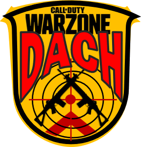

# DACH Warzone – Gaming Overlay (Projekt Blueprint)



## Projektziel

Entwicklung eines **leichtgewichtigen Gaming-Overlays für Windows**, speziell für die Community **DACH Warzone**.
Das Overlay soll während des Spielens sichtbar sein und nützliche Informationen anzeigen, ohne die Performance oder Sicht zu stören.

Das Tool wird lokal auf dem PC ausgeführt und als **.exe Datei** bereitgestellt, damit es einfach von Clan-Mitgliedern installiert werden kann.

Ziel ist ein **Community Companion Tool**, das Hardwareinformationen, Discord-Daten und optionale Gaming-Statistiken kombiniert.

---

# Grundidee

Das Overlay läuft als **transparentes Fenster über dem Spiel** und zeigt relevante Informationen an.

Beispiele:

```
DACH WARZONE

CPU: 62°C
GPU: 65°C
FPS: 144
Ping: 18ms

Discord:
5 Leute im Voice
Squad: Online
```

Das Tool soll:

* minimalistisch
* performant
* leicht installierbar
* modular erweiterbar

sein.

---

# Kernfunktionen (MVP)

## 1 Hardware Monitoring

Anzeige wichtiger Systemwerte.

Metriken:

* CPU Temperatur
* GPU Temperatur
* CPU Auslastung
* GPU Auslastung
* RAM Nutzung
* Lüftergeschwindigkeit (falls verfügbar)

Datenquelle:

LibreHardwareMonitor API oder WMI.

Updateintervall:

1–2 Sekunden.

---

## 2 Gaming Overlay

Das Overlay muss folgende Eigenschaften besitzen:

* transparent
* immer im Vordergrund
* kein Fensterrahmen
* optional klick-durchlässig
* verschiebbar im Konfigurationsmodus

Position:

Standardmäßig oben links oder oben rechts im Bildschirm.

---

## 3 Discord Integration

Das Overlay zeigt einfache Informationen über die Discord-Community.

Beispiele:

* Anzahl User im Voice Channel
* aktueller Voice Channel Name
* Clan-Mitglieder online

Optional:

* Anzeige des aktuellen Squads
* Voice Aktivität (wer gerade spricht)

Kommunikation über:

Discord API oder Rich Presence.

---

## 4 Community Branding

Das Overlay soll visuell zur Community passen.

Elemente:

* Clan Name: **DACH WARZONE**
* optional Logo
* Farbschema

Beispiel:

```
Grün / Neon
Schwarz transparent
Militär / Tactical Style
```

---

# Erweiterbare Features (Phase 2)

Diese Features sind nicht zwingend für Version 1, aber in der Architektur vorgesehen.

## Lüftersteuerung

Optionale Steuerung der Lüfter über externe Tools.

Möglichkeiten:

* Integration mit FanControl
* Wechsel von Lüfterprofilen
* Automatische Anpassung bei Temperatur

Risiko:

Direkte Hardwaresteuerung ist stark abhängig vom Mainboard.

---

## Warzone Stats Integration

Anzeige von Spielstatistiken.

Beispiele:

* Kills
* Damage
* K/D
* Gulag Winrate

Datenquelle:

Warzone Tracker API oder ähnliche Dienste.

---

## Squad Overlay

Anzeige des aktuellen Squads.

Beispiel:

```
SQUAD

Alex
Ghost
Viper
Shadow
```

Optional:

* Online Status
* Voice Aktivität

---

## Community Events

Anzeige von:

* Clan Events
* Turnieren
* Server News

---

# Technische Architektur

## Programmiersprache

Python 3.11+

Grund:

* schnelle Entwicklung
* große Library Auswahl
* einfache Distribution

---

## UI Framework

PyQt6 oder PySide6

Verantwortlich für:

* Overlay Fenster
* UI Rendering
* Transparenz
* Always-On-Top Verhalten

---

## Hardware Monitoring Layer

Datenquelle:

LibreHardwareMonitor

Kommunikation:

WMI oder lokale API.

Aufgabe:

* Sensoren auslesen
* Werte normalisieren
* an UI weitergeben

---

## Discord Integration Layer

Verantwortlich für:

* Voice Channel Informationen
* Online Status
* Community Daten

Technologien:

* Discord API
* WebSocket Events
* REST Requests

---

## Overlay Renderer

Rendern der Informationen im Overlay.

Komponenten:

* Textanzeigen
* Icons
* Statusindikatoren

Anforderungen:

* geringe CPU Nutzung
* Aktualisierung alle 1–2 Sekunden
* skalierbare UI

---

## Konfigurationssystem

Speicherung der Benutzeroptionen.

Beispiele:

```
config.json
```

Konfigurierbar:

* Overlay Position
* Overlay Größe
* aktivierte Module
* Farben
* Update Intervall

---

# Software Architektur

Empfohlene Projektstruktur:

```
dachwarzone-overlay
│
├── main.py
│
├── overlay
│   ├── overlay_window.py
│   ├── ui_renderer.py
│
├── hardware
│   ├── sensor_reader.py
│
├── discord
│   ├── discord_client.py
│
├── services
│   ├── stats_service.py
│
├── config
│   ├── config_loader.py
│
└── assets
    ├── logo.png
```

---

# Performance Anforderungen

Das Overlay darf beim Spielen **keine spürbare Performance kosten**.

Zielwerte:

CPU Nutzung
unter 2 %

RAM
unter 150 MB

Update Rate
1–2 Sekunden

---

# Distribution

Das Tool wird als **Windows .exe Datei** verteilt.

Build Tool:

PyInstaller

Build Beispiel:

```
pyinstaller --onefile main.py
```

Optional:

```
--noconsole
--icon=logo.ico
```

---

# Sicherheit

Wichtige Punkte:

* keine Game Memory Hooks
* keine Eingriffe in Anti-Cheat Systeme
* nur externe Datenquellen

Ziel:

Das Tool darf **keine Anti-Cheat Probleme verursachen**.

---

# UI Design Idee

Minimalistisches Gaming Overlay.

Beispiel:

```
[DACH WARZONE]

CPU 61°C
GPU 65°C
RAM 42%

Discord
Voice: 6
```

Farben:

```
Neon Grün
Dunkelgrau transparent
```

Stil:

Tactical / Military.

---

# Langfristige Vision

Das Overlay kann zu einem **Community Companion Tool** ausgebaut werden.

Mögliche Funktionen:

* Warzone Stats
* Squad Management
* Community Events
* Hardware Monitoring
* Discord Integration
* Streamer Tools

Ziel:

Ein **zentrales Tool für die gesamte Community**.

---

# Zusammenfassung

Das Projekt ist ein **modulares Gaming Overlay für die DACH Warzone Community**.

Hauptfunktionen:

* Hardware Monitoring
* Discord Integration
* Gaming Overlay
* Community Branding

Technologien:

* Python
* PyQt6
* LibreHardwareMonitor
* Discord API

Das Tool soll **leichtgewichtig, stabil und einfach nutzbar** sein.

---

# Nächste Schritte

1. Projektstruktur erstellen
2. Overlay Fenster implementieren
3. Hardware Sensoren auslesen
4. Discord Integration hinzufügen
5. UI Design erstellen
6. EXE Build erstellen
7. Community Testphase

---

Ende des Dokuments
